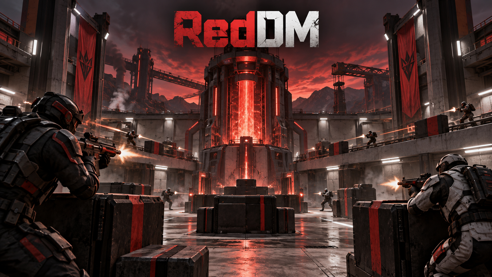

# RedDM



RedDM is a compact online FPS deathmatch prototype built as a separate Red Engine 2 game project.
Its first map, **Foundry Nine**, is a three-lane industrial arena with two flank routes, a central
reactor landmark, ten network spawn points, readable red cover, and moving physics props. Players
are human combatants; the engine's Cheddar character is not part of this game.

Clone `RedEngine` and `RedEngineGames` beside one another. This published project pins
`../../../RedEngine`, keeping all engine code in the engine repository while the game remains here.

## Play

For direct local single-player testing (no server or network connection):

```powershell
.\scripts\play-solo.ps1
```

The **RedDM Solo** desktop shortcut runs this mode. The **RedDM** shortcut hosts and joins a local online match.

On Windows, the **RedDM** desktop shortcut starts a local server and joins it automatically.
The command-line equivalent is below.

On Windows, build/check once and start the authoritative server:

```powershell
.\scripts\red.ps1 check
.\scripts\red.ps1 serve
```

Run this in a second terminal for each local player:

```powershell
.\scripts\red.ps1 play 127.0.0.1:27015
```

For internet play, the host forwards UDP 27015 or uses Red Engine's UPnP support. Use a join key for
public networks; see the engine's `docs/HOSTING.md`.

## Controls

- WASD move; Shift sprint; Ctrl crouch; Space jump
- Mouse look; left mouse attacks
- Right mouse smoothly aims down sights
- Mouse wheel cycles the bat and eleven firearms
- R reloads; E picks up/drops loose props; Q toggles third person; Esc pauses

## Match

The server owns movement, hits, damage, deaths, respawns, score and physics. A lobby requires two
ready players, then runs an eight-minute round to 30 kills, followed by results and rematch. The current
prototype scores individuals (free-for-all deathmatch); explicit team assignment, team-colored characters,
friendly-fire rules, automatic fire, per-gun magazines and weapon selection UI are the next engine milestones.

## Project structure

- `blueprints/main.blueprint.json` — source for Foundry Nine; builds the committed map deterministically
- `maps/main.json` — self-contained playable map
- `assets/gameplay.json` — original procedural RedDM cover and reactor prefabs
- `DESIGN_GAPS.md` — engine audit, what was generalized, and the next reusable improvements

No RedDM game code lives in RedEngine. The game pins a sibling engine checkout through `game.json`.
