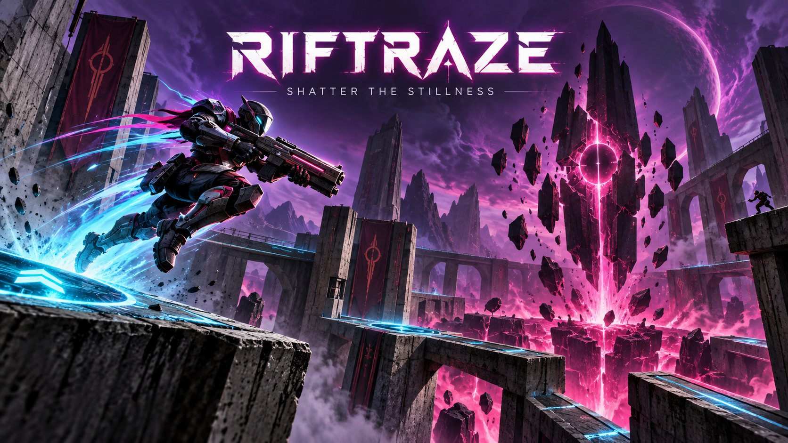

# RiftRaze



**RiftRaze** is a hyperkinetic online arena FPS built as a standalone Red Engine 2 game.
Its first arena, **Shattercore**, is a compact nine-zone battleground with broad archways, a
central rift monolith, an elevated combat loop and four cyan launch pads.

The movement profile is intentionally aggressive: a 90-degree default field of view, 9 m/s
movement, 13.5 m/s sprinting, a low crouch penalty, a stronger jump and reduced gravity. Players
are human combatants, spawn with the shotgun and can cycle through the engine's full eleven-firearm arsenal.

## Play

For direct local single-player testing (no server or network connection):

```powershell
.\scripts\play-solo.ps1
```

The **RiftRaze Solo** desktop shortcut runs this mode. The **RiftRaze** shortcut hosts and joins a local online match.

On Windows, the **RiftRaze** desktop shortcut starts a local authoritative server and joins it.
The command-line equivalent is:

```powershell
.\scripts\red.ps1 check
.\scripts\red.ps1 serve
```

Then, in a second terminal for every player:

```powershell
.\scripts\red.ps1 play 127.0.0.1:27016
```

For LAN play, use the host computer's LAN address. For internet play, forward UDP 27016 or use
Red Engine's UPnP option and a join key; see the engine's `docs/HOSTING.md`.

## Controls

- WASD move; Shift sprint; Ctrl crouch; Space jump
- Mouse look; left mouse fires; right mouse smoothly aims down sights
- Mouse wheel cycles weapons; R reloads
- E picks up or drops loose props; Q toggles third person; Esc pauses

## Match

The authoritative server owns movement, launch-pad impulses, hits, health, respawns and score.
Two ready players begin a seven-minute free-for-all round; first to 40 wins. Shattercore provides
12 arena spawns and is suitable for a small group beyond the initial two-player target.

## Project structure

- `blueprints/main.blueprint.json` — authored source for Shattercore
- `maps/main.json` — deterministic, self-contained playable map
- `assets/gameplay.json` — original procedural rift pad, pylon and Shattercore prefabs
- `outputs/` — verified plan and 20-view graphical tour
- `DESIGN_GAPS.md` — engine audit and logical future improvements

The project does not fork or embed Red Engine. It exercises reusable engine features added during
development: scene-authored movement/FOV, authoritative jump pads and configurable starting weapons.

For a source checkout, clone `RedEngine` and `RedEngineGames` beside one another. This published
project pins `../../../RedEngine`; all reusable engine code remains in the engine repository.
